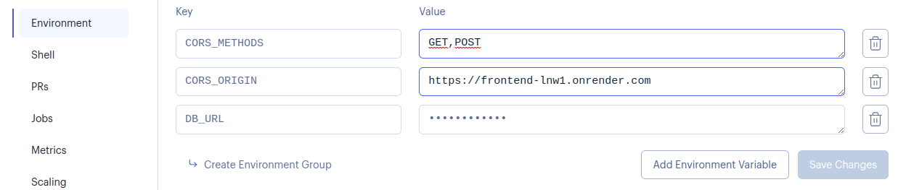

# Adaptaciones no código para despregar en producción

<!-- TOC -->

- [Adaptaciones no código para despregar en producción](#adaptaciones-no-c%C3%B3digo-para-despregar-en-producci%C3%B3n)
    - [Backend](#backend)
        - [CORS](#cors)
    - [Frontend](#frontend)
    - [Despregando en Render](#despregando-en-render)
        - [Creando a nosa base de datos na nube.](#creando-a-nosa-base-de-datos-na-nube)
        - [Despregando o backend](#despregando-o-backend)
        - [Despregando o frontend](#despregando-o-frontend)
        - [Parametros para CORS](#parametros-para-cors)

<!-- /TOC -->


## Backend
* Empregar `process.env.PORT` como primeira opción para o porto de escoita de Express e proporciona unha alternativa para o entorno de development.
```js
app.listen(process.env.PORT ?? 8000, ()=>{
    //...
})
```
* Proporciona diferentes alternativas de base de datos para os diferentes entornos (production, development, etc.). Ten en conta que probablemente os datos de acceso á base de datos de producción incluan elementos que deberás manter en segredo, como contrasinais. Proporciona esos datos desde variables de entorno que configurarás na plataforma na que despregarás a túa aplicación.
```js
const db = new Sequelize(
    process.env.NODE_ENV === "production"
    ? process.env.DB_URL
    : 'sqlite:baseDeDatos.sqlite'
)
```
* Move calquera outro dato confidencial a variables de entorno: secretos de firma de JWT, API keys, claves criptográficas, etc...
```js
const JWT_SECRET = process.env.JWT_SECRET
```

### CORS
Os navegadores seguen unha política de restricción para que só o JavaScript que procede dunha dirección poda facer peticións (fetch) a esa dirección (_same-origin policy_). Dese xeito impídese que scripts de terceiros podan acceder á información do noso backend empregando as credenciais dos usuarios. Os scripts que poderían intentar estos accesos incluen anuncios de pasarelas, bibliotecas de JavaScript instadas desde CDN como Bootstrap ou Leaflet, pasarelas de pago, etc.

No noso caso este comportamento do navegador supón un problema, porque a dirección de Internet do noso frontend, de donde proceden os scripts de JavaScript, non é a mesma que a dirección do backend, de xeito que o navegador non permitirá ós nosos scripts do frontend facer consultas no backend. Para solucionar esto dispoñemos de CORS, que é un mecanismo que permite que o noso backend indique ó navegador desde qué orixes permitimos facer consultas ó noso backend.

Como nas adaptacións anteriores para o desplegue, necesitaremos definir dous escenarios para a nosa aplicación. En __desenrolo__ permitiremos o acceso para calquera tipo de petición desde calquera orixe. En __producción__ só permitiremos acceso ós scripts que proceden do dominio do noso frontend e, opcionalmente, só para os métodos HTTP que sexa necesario.

```js
app.use(
    cors({
        origin: process.env.CORS_ORIGIN ?? "*",
        methods: process.env.CORS_METHODS ?? "GET,HEAD,PUT,PATCH,POST,DELETE",
        preflightContinue: false,
        optionsSuccessStatus: 204
    })
)
```

Lembra que estamos empregando un middleware, así que ainda que no exemplo se aplica a mesma configuración de CORS para todos os endpoints, podemos alternativamente establecer políticas individuais para cada endpoint.

## Frontend
* Proporciona as URL para o backend tanto para os entornos de desenrolo como de producción. Podes determinar se a aplicación se atopa en desenrolo ou en producción consultando `window.location.hostname`. En desenrolo adoita ser `localhost` ou `127.0.0.1`
```js
const BACKEND_URL = ["localhost", "127.0.0.1"].includes(window.location.hostname)
    ? "http://localhost:8000"
    : "https://direccion.dobackend.eninternet.com"
```
Logo disto, modifica as chamadas a `fetch` ou calquera outra chamada á API do teu backend do seguinte xeito. Onde tiñas algo como:
```js
fetch("http://localhost:8000/api/artigos")
```
Modifícao dun xeito semellante a este:
```js
fetch(BACKEND_URL+"/api/artigos")
```

## Despregando en Render

En [Render](https://render.com) podes atopar un lugar onde facer as túas primeiras probas de para publicar a túa aplicación web sen ter que gastar cartos.

Iniciar sesión en Render empregando o botón co logotipo de GitHub para que render poda acceder ó código dos teus repositorios.

Empeza por facer no backend as adaptacións necesarias para o despregue. Despois de despregar o backend poderás ver a súa dirección en internet para poder adaptar o frontend.

### Creando a nosa base de datos na nube.

// TODO

### Despregando o backend
Para despregar o backend crea un novo __Web Service__ (mellor Private Service se queres proporcionar un método de pago) no panel de Render. Selecciona o repositorio da túa aplicación e proporciona os datos requeridos:
* __Name__: Proporciona un nome para identificar este servicio e diferencialo doutros.
* __Region__: Selecciona a ubicación xeográfica desde a que darás o servicio. Escolle algún lugar dentro da Unión Europea por cuestións de protección de datos.
* __Branch__: Cal é a rama do teu repositorio onde está o código rematado?. Normalmente `main` ou `master`.
* __Root Directory__: Dentro do contido do repositorio, en qué carpeta se atopa o código do backend?. Para o exemplo do repositorio é a carpeta `backend`.
* __Runtime__: Cal é a linguaxe de programación do backend da túa aplicación. Para o exemplo `Node`.
* __Build Command__: Comandos a executar antes de poder poñer en marcha o proxecto. No caso do exemplo `npm install`.
* __Start Comand__: Cómo se pon en marcha o backend?. No noso caso `npm run start`.

Selecciona a franxa de pago que prefiras (por omisión está marcada a gratuita) e busca o botón para crear o Web Service no pe da páxina. Cando o pulses empezará o proceso de construcción e desplegue do backend. Na parte superior da páxina poderás ver en qué dirección de internet estará dispoñible.

Asegúrate de comprobar que todo funciona axeitadamente. Podes empregar aplicacións como [Insomnia](https://insomnia.rest/) para elo.

### Despregando o frontend

Unha vez que xa coñezas en qué enderezo de Internet está funcionando o backend, podes aplicar as adaptacións necesarias no frontend, tal e como vimos nos apartados anteriores.

Logo, podes despregar o teu frontend creando un novo __Static Site__ en Render. Selecciona o repositorio da túa aplicación e proporciona os datos requeridos:

* __Name__: Proporciona un nome para identificar este servicio e diferencialo doutros.
* __Branch__: Cal é a rama do teu repositorio onde está o código rematado?. Normalmente `main` ou `master`.
* __Root Directory__: Dentro do contido do repositorio, en qué carpeta se atopa o código do frontend?. Para o exemplo do repositorio é a carpeta `frontend-react` ou `frontend-svelt` según che interese. Tamén podes desplegar as dúas versións creando cadanseu __Static Site__.
* __Build Command__: Qué comandos temos que executar para obter o código [vanilla](https://en.wikipedia.org/wiki/Vanilla_software) (HTML+CSS+JS) da nosa interface. Para os casos do exemplo sería `npm install; npm run build` tanto para o caso de React como o de Svelte.
* __Publish directory__: Unha vez finalizada a execución do "build command", en qué carpeta atopamos o resultado de dito proceso?. Para o caso dos exemplos, `dist` tanto para Svelte como para React.

Selecciona a franxa de pago que prefiras (por omisión está marcada a gratuita) e busca o botón para crear o Web Service no pe da páxina. Cando o pulses empezará o proceso de construcción e desplegue do backend. Na parte superior da páxina poderás ver en qué dirección de internet estará dispoñible.

As aplicacións que creamos con Svelte ou React adoitan ser SPA (Single Page Applications). Esto implica que, a pesar de que utilizan las rutas de la URL para mostrar diferentes vistas, la web que consituye la aplicación está alojada en una única ruta.

Para que estas aplicaciones funcionen bien, hemos de configurar el servicio de la página web para que todas las rutas empleadas por las vistas sean dirigidas a la única ruta real de la aplicación. En Render puedes hacer esto configurando el static site con una _reescritura_ tal y como ves en la figura.


### Parametros para CORS

Unha vez que coñecemos o enderezo do noso frontend en Internet, temos que regresar ó noso __web service__ do backend para configurar as variables de entorno precisas:

__☝️ Presta atención á ausencia de barra despois da URL ☝️__

Asegúrate de comprobar que todo funciona axeitadamente accedendo co navegador á URL proporcionada para o frontend.
